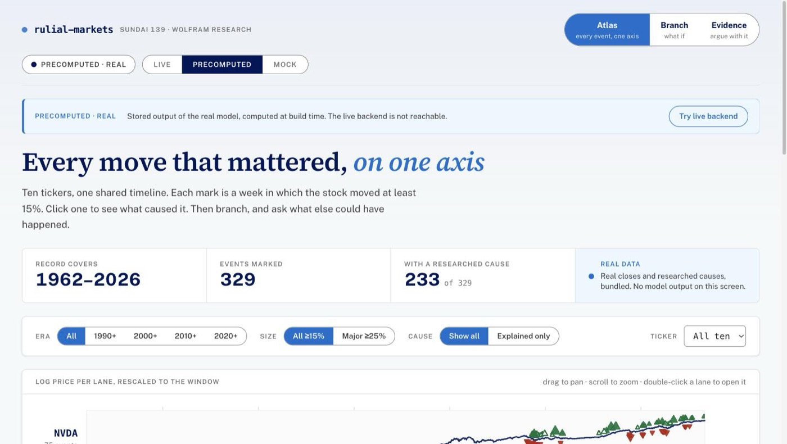
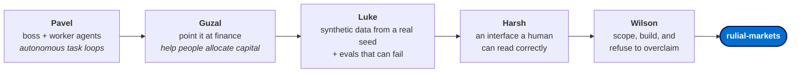
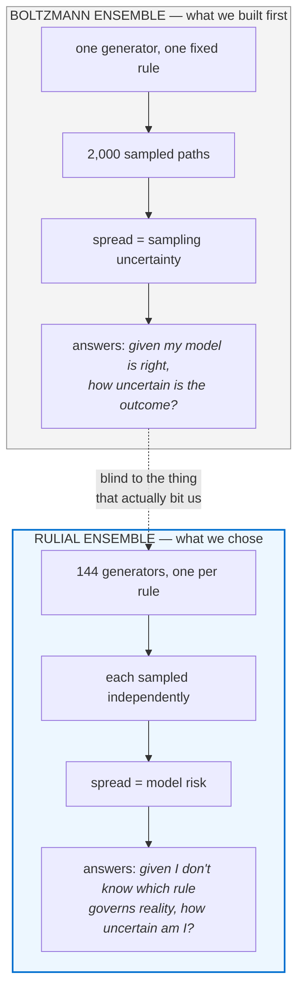
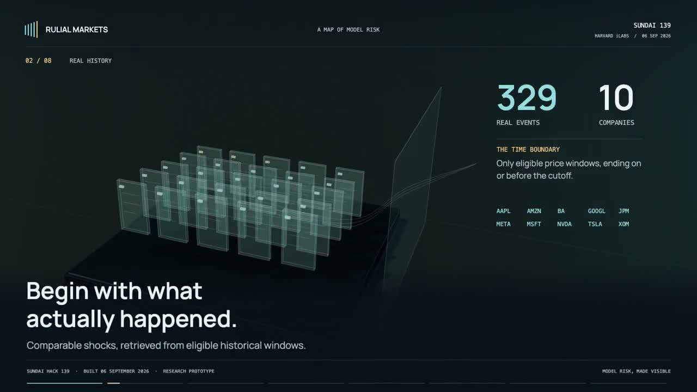
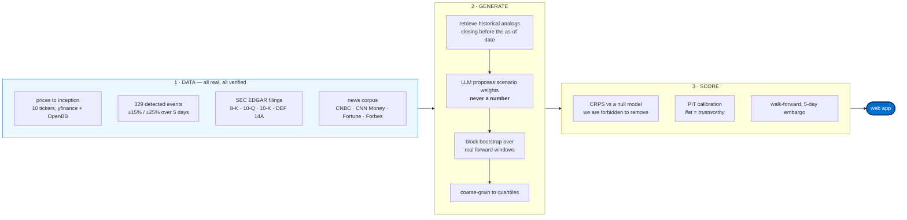

# rulial-markets

**Can AI help an individual value investor make better decisions?**

Built at [Sundai Hack 139](https://www.sundai.club/events/boston/wolfram-hack), Harvard iLabs,
6 September 2026. Theme: *AI Agents That Adapt and Evolve, with Wolfram Research*.

[](LICENSE)
[](backend/tests)
[](data/events.jsonl)

**Live app → https://rulial-markets.wilson-af8.workers.dev**



*Every event that moved any of the ten tickers, on one axis, 1962 to 2026. Click a mark to see what caused it. Then branch, and ask what else could have happened.*

---

## The problem

Every retail investor faces the same question and has no honest tool for it:

> *"Something just happened to a company I own. Does it matter?"*

The tools that exist answer the wrong question. Sell-side research gives you a price target,
which is a point prediction dressed as analysis. Screeners give you ratios. Financial media
gives you a narrative built after the fact. None of them tell you the one thing a long-horizon
investor actually needs: **given an event like this, what has historically happened, how much
did it vary, and how much should I trust that range?**

We wanted to know whether AI could close that gap. Not for a trading desk. For one person
deciding whether a business they own can take a punch.

---

## The team

| | Who | What they brought |
|---|---|---|
| 🧠 | **[Pavel Tkachyk](https://www.linkedin.com/in/pavel-tkachyk/)** · [@Pavel-Tk](https://github.com/Pavel-Tk) | Showed the team the boss-and-worker agent pattern: one agent plans and delegates, another executes, and the loop runs autonomously. His [`auto-data-scientist`](https://github.com/Pavel-Tk/auto-data-scientist) plugin is that idea in production. This became the shape of how we built. |
| 📈 | **[Guzal K.](https://www.linkedin.com/in/guzalk/)** · [@guzalkhonkh-stack](https://github.com/guzalkhonkh-stack) | Proposed pointing the pattern at markets: build a finance agent that actually helps you allocate capital. Every design decision downstream traces to her framing of the goal as *investing*, not *trading*. |
| 🔬 | **[Luke Rast](https://www.linkedin.com/in/luke-rast-2b5b5b56/)** · [@lrast](https://github.com/lrast) | Drafted the data framework: how to generate synthetic scenarios from a real seed corpus, and, critically, how to build evaluations that prove the thing works instead of assuming it. The evaluation discipline in this repo is his contribution and it is the reason we found our own bugs. |
| 🎨 | **[Harsh Kumar](https://www.linkedin.com/in/harsh-kumar-mit/)** · [@harshk02](https://github.com/harshk02) | Drove the interface: what a user should see, in what order, and how a probabilistic result can be read at a glance without being misread. Also pushed for graceful degradation, which is why the demo survives a dead backend. |
| 🧩 | **[Wilson Wu](https://www.linkedin.com/in/wilson1wu/)** · [@wilsonwu-ai](https://github.com/wilsonwu-ai) | Pulled four ideas into one buildable project, set the scope, ran the build, and held the line on intellectual honesty: no fabricated numbers, no metric we could game, and every claim reported at the weaker of two readings. |

---

## S — Situation

The project assembled itself out of a conversation, in this order.



**Pavel** started it by showing how he runs two agents against each other, a planner and an
executor, to complete work without a human in the loop. **Guzal** asked the obvious next
question: what if that machine did something useful with money? **Luke** supplied the missing
rigor, arguing that a model generating financial scenarios is worthless without an evaluation
harness that can declare it wrong, and that the synthetic data has to be anchored to a real
seed corpus or it just launders assumptions. **Harsh** made sure the output could be read by a
person without misleading them. **Wilson** scoped it to something buildable in a day and
enforced the rule that ended up defining the project: **every number we show is measured, and
where we are uncertain we report the weaker number.**

Then the theme pushed us somewhere specific. Working from Phileas's session and the Wolfram
Institute's framing, we had to decide what kind of ensemble we were actually building.

### We considered Boltzmann. We chose rulial.



Wolfram's rulial ensemble is explicitly *an ensemble of possible rules*, and he contrasts it
against the gas case, which is Boltzmann's ensemble over configurations under one fixed rule. A
Monte Carlo over paths from a single generator is the gas case. We built that first, and we
kept it, because the comparison is the argument.

**Why we preferred rulial, concretely:**

1. **Boltzmann's spread is conditional on a rule we picked.** It reports sampling uncertainty
   and is structurally blind to model risk.
2. **We measured our model risk, and it is larger than our sampling risk.** An
   analog-resampling generator scores **+14.8% CRPS lift that becomes −4.5% when demeaned.**
   The drift assumption is a *rule choice*, and the answer flips sign when you change it. A
   Boltzmann ensemble cannot see that by construction. A rulial ensemble surfaces it without
   anyone remembering to check.
3. **It matches Wolfram's actual argument.** For a computationally irreducible process, a
   bounded observer does not know which rule generates reality. Averaging configurations under
   an assumed rule assumes away the hardest part of the problem.
4. **It raises our own reporting bar.** Under the rulial construction only *invariants* —
   properties holding under at least 90% of the 144 generators — may be stated as findings.
   Anything that flips across rules is labelled rule-dependent and can never be called skill.
   We adopted that standard deliberately, against our own interest.

**The honest concession:** our 144-point grid is a small, hand-chosen slice of rule space, not
Wolfram's full rulial ensemble. We chose the axes, which is itself a rule choice we cannot
escape. Full argument in [`docs/BOLTZMANN_VS_RULIAL.md`](docs/BOLTZMANN_VS_RULIAL.md).

---

## T & A — Task and Action

### Watch it first — 93 seconds

<video src="https://github.com/wilsonwu-ai/rulial-markets/raw/main/docs/video/rulial-markets.mp4" controls muted playsinline poster="docs/img/video-poster.jpg" width="100%"></video>

[](https://github.com/wilsonwu-ai/rulial-markets/raw/main/docs/video/rulial-markets.mp4)

*If the player does not load, the image above links straight to the file.*
Subtitles: [`rulial-markets.srt`](docs/video/rulial-markets.srt) ·
Narration and timings: [`presenter-notes.md`](docs/video/presenter-notes.md)

| | Chapter | |
|---|---|---|
| 01 | The question | 0.0–10.0s |
| 02 | Real history | 10.0–22.4s |
| 03 | Possible outcomes | 22.4–35.5s |
| 04 | **The hidden assumption** | 35.5–41.2s |
| 05 | The space of rules | 41.2–53.9s |
| 06 | **Model disagreement** | 53.9–68.2s |
| 07 | What survives | 68.2–81.0s |
| 08 | Rulial Markets | 81.0–92.7s |

Chapters 04 through 07 are the argument. Four is the drift assumption nobody states. Five is why
we ensemble over rules rather than paths. Six is those rules disagreeing, which is the thing a
single-generator Monte Carlo cannot show you. Seven is what is left once you only keep what
survives all of them.

---

**Task:** build a web app where a value investor describes an event and gets an honest read on
what it means for a stock, with the evidence attached.

**Action:** we froze a contract, then built against it in parallel.



### How the scenarios are actually produced

We do generate many scenarios, but not the way "Monte Carlo" is usually meant, and the
difference matters:

- **We do not sample from a fitted parametric model.** Every path is a **block bootstrap over
  five-day windows that actually happened** in the price history, hard-filtered so no analog's
  forward window closes after the as-of date. Each path traces back to a real week you can go
  look up.
- **The LLM never emits a number.** It reads the event text and returns *scenario weights and
  drift/vol adjustments* — "this is a continuation regime, widen the distribution." The moment
  it emits a probability we have built a point predictor and lost the argument.
- **We report a calibrated distribution, not a confidence level.** A single confidence number
  collapses the distribution back into a point prediction wearing a percent sign. The output is
  the range, plus a score saying how much to trust the range's *width*.
- **The rulial layer runs all of that 144 times**, once per rule, and reports only what
  survives.

### Time boundary

Everything the model may see stops at **2019-12-31**. Testing runs 2020 onward with a 5-day
embargo. Full guard rationale, rendered: [`docs/diagrams/03-why.html`](docs/diagrams/03-why.html).

### Deeper diagrams

| | |
|---|---|
| [`01-what.html`](docs/diagrams/01-what.html) | what the product does, end to end |
| [`02-how.html`](docs/diagrams/02-how.html) | system architecture and module ownership |
| [`03-why.html`](docs/diagrams/03-why.html) | the four leak guards and what breaks without each |
| [`04-rulial.html`](docs/diagrams/04-rulial.html) | the Wolfram mapping, graded rigorous vs analogical |

---

## R — Result

A working web app that gives a value investor a fast, honest pulse check on whether an event
matters to a stock.

**→ https://rulial-markets.wilson-af8.workers.dev**

### What we measured

| Result | Number |
|---|---|
| Events detected and price-verified | **329** across 10 tickers, zero mismatches at 5bp |
| Events with a researched, sourced cause | **233** with a cause, **153** with a clickable URL |
| Walk-forward lift over null, NVDA | **+1.26%** over 32 tests, calibration passes |
| Ceiling for a *cheating* oracle using realized post-jump sigma | **+2.0%** |
| Paired-control experiment | **+7.6%** lift difference from the event text alone |

That +1.26% is roughly **63% of what an oracle that cheats achieves.** Read alone it looks
small; read against the ceiling it is most of what is there.

### The paired control

Same ticker, same date, same available analogs. Only the event text differs.

| NVDA, as of 2016-11-10 | CRPS lift | median |
|---|---|---|
| True text (datacenter blowout) | **+9.0%** | +0.26% |
| Fabricated bearish text | **+1.4%** | −0.93% |

The model responds to the *text*, not to memorized history. That is our answer to the leakage
objection, and it is an experiment rather than an assertion.

### What this is good for, and what it is not

**Built for the individual value investor.** Someone holding a business for years who wants to
know whether a shock is survivable, grounded in what actually happened to comparable companies
in comparable situations, with the filings and articles attached.

**Explicitly not built for high-frequency trading desks or hedge funds.** Our horizon is five
days, our data is daily, and our edge over a naive baseline is roughly one percent. There is no
alpha here for anyone with a co-location cage. Anyone telling you a hackathon project beats a
quant fund is selling something.

**And the finding we did not want:** over five days, **direction is close to a coin flip.**
P(down) tops out near 0.54 no matter how catastrophic the news we describe. Forward direction
has an out-of-sample R² of approximately zero; forward *dispersion* has R² ≈ 0.10. Volatility
is predictable, direction is not. We could have hidden that. It is on the results screen
instead, because a tool that knows what it cannot predict is worth more than one that pretends.

### Data provenance, stated exactly

- **Prices:** yfinance, cross-checked against OpenBB, split-adjusted, to each ticker's inception.
- **Filings:** SEC EDGAR submissions API — 8-K, 10-Q, 10-K, DEF 14A. 1,129 corpus documents.
- **News:** CNBC, CNN Money, Fortune, Forbes, Benzinga, TechCrunch, federalreserve.gov, SEC.gov.
- **We do not use Bloomberg.** It is paywalled and we never accessed it.

---

## Run it

MIT licensed and fully open source. No API keys required, no accounts, no paid data feeds.

```bash
git clone https://github.com/wilsonwu-ai/rulial-markets && cd rulial-markets
make install     # creates .venv, installs Python + npm dependencies
make data        # builds the event ledger and news corpus from public sources
make demo        # FastAPI on :8000, Next.js on :3000
```

**This path is tested, not assumed.** On 2026-09-06 we cloned the repo into a clean directory
and ran it from scratch:

| Step | Result |
|---|---|
| `make install` from a bare clone | exit 0, Python and npm dependencies both |
| Every core module imports | `config, types, data, events, generator, evaluate` ✅ |
| `pytest backend/tests` | **378 passed** |
| API boots and answers | `{"ok":true}`, all five modules loaded |
| `/api/events?ticker=NVDA` | 39 events returned |

The deployed frontend also runs on precomputed real results, so the web app works with no
backend running at all. `make demo` gives you the live version with your own data.

**Optional.** Set `ANTHROPIC_API_KEY` to enable LLM-proposed scenario weights. Without it the
generator falls back to a deterministic keyword prior and **says so loudly in its output** —
it never pretends a fallback was a model result.

## License

[MIT](LICENSE). Use it, fork it, sell something built on it. Attribution appreciated, not required.

**Not investment advice**, and the project's own findings say direction is close to
unpredictable over five days. Disclosures, contributor list and third-party data terms are in
[`NOTICE.md`](NOTICE.md).

## Repo map

| Path | What |
|---|---|
| [`CONTRACT.md`](CONTRACT.md) | The frozen interface. Module ownership, API, and the rules no one may tune. |
| [`docs/PRD.md`](docs/PRD.md) | Product requirements and the claimable backlog. |
| [`docs/BACKEND_LOGIC.md`](docs/BACKEND_LOGIC.md) | How the backend actually works, stage by stage. |
| [`docs/BOLTZMANN_VS_RULIAL.md`](docs/BOLTZMANN_VS_RULIAL.md) | Why we chose the rulial construction. |
| [`docs/research/`](docs/research/) | Ten per-ticker investigations plus cross-ticker synthesis. |
| `backend/rulial/` | Data, event detection, news, generator, evaluation, inverse solver, API. |
| `frontend/` | Next.js app. |

## Status

Built in one day. Working, measured, and honest about its limits.

**The memorization test, measured rather than argued.** Across tickers with at least three
events in each bucket, mean CRPS lift on *famous* events is **-5.94%** against **-0.55%** on
obscure ones. A model recalling its training data would do better on the famous ones. Ours does
worse. Computed from `per_event.famous` in the shipped backtests, not asserted.
