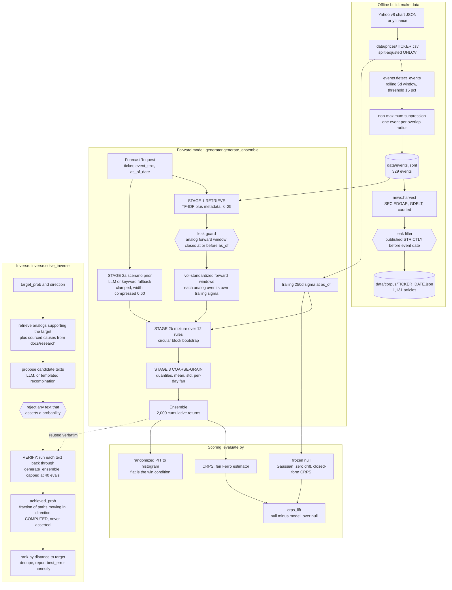

# BACKEND_LOGIC.md: how rulial-markets actually works

**Audience:** a technical judge, or a teammate who did not write this code.
No prior knowledge of the repo is assumed.

**The one-paragraph version.** You give the system a conditional event in plain
English ("NVIDIA reports datacenter revenue up 193%") plus an `as_of_date`. It
retrieves real historical jump events whose outcomes were already knowable at
that date, resamples their realized post-event windows under a set of competing
generator rules, and returns 2,000 forward return paths coarse-grained to
quantiles. It then scores that ensemble against what actually happened using
CRPS, always next to a frozen null model, and reports the lift. It never emits a
point prediction, and no language model is ever allowed to state a probability.

Everything in this document is either quoted from the source or was measured by
running the code in this repo. Section 12 lists the exact commands that reproduce
them. Where a number could not be reproduced, that is said out loud.

---

## 1. Module map

| File | Role | Lines that matter |
|---|---|---|
| `backend/rulial/config.py` | Frozen constants. Universe, time boundary, thresholds. Parent-owned, no lane may edit it. | `TRAIN_END`, `TIER_MAJOR`, `WINDOW_DAYS` |
| `backend/rulial/types.py` | Frozen dataclasses: `Event`, `Article`, `ForecastRequest`, `Ensemble`, `Score`. | the wire format |
| `backend/rulial/data.py` | Price loading and the on-disk cache. Trailing volatility. | `load_prices`, `trailing_vol` |
| `backend/rulial/events.py` | Jump detection, non-maximum suppression, the event ledger. | `detect_events`, `split_ledger` |
| `backend/rulial/news.py` | News and filing harvest with the strictly-before leak filter. | `_passes_leak_filter` |
| `backend/rulial/generator.py` | The forward model. Retrieval, rule mixture, bootstrap, coarse graining. | `generate_ensemble` |
| `backend/rulial/evaluate.py` | CRPS, the null model, PIT, walk-forward. | `crps`, `walk_forward` |
| `backend/rulial/api.py` | FastAPI. Five frozen routes, no route ever raises to the client. | `/api/forecast`, `/api/backtest` |
| `backend/rulial/inverse.py` | The inverse scenario search. Target probability in, candidate event texts out, every probability computed by the forward model. | `solve_inverse`, `_Verifier.run` |

Frozen constants, quoted verbatim from `config.py`:

```python
UNIVERSE = ["NVDA", "AAPL", "MSFT", "AMZN", "TSLA", "META", "GOOGL", "JPM", "XOM", "BA"]
TRAIN_END = "2019-12-31"
TEST_START = "2020-01-01"
TEST_END = "2024-12-31"
EMBARGO_DAYS = 5
TIER_MAJOR = 0.25
TIER_SIGNIFICANT = 0.15
JUMP_THRESHOLD = TIER_SIGNIFICANT   # detection floor; tier is labelled per event
WINDOW_DAYS = 5
NULL_VOL_LOOKBACK = 250
```

---

## 2. Data flow



---

## 3. Stage one: prices

`data.py` fetches once and reads from disk forever after. Nothing in the module
touches the network at import time.

**Fetch order.** `yfinance` if importable, then a zero-dependency `urllib` call
to Yahoo's public `/v8/finance/chart` JSON endpoint, then a clearly labelled
synthetic fallback. The two real paths were cross-checked against each other at
a maximum relative close difference of 2e-16 over 1,761 NVDA rows spanning the
2021 4:1 and 2024 10:1 splits. The urllib path exists because Yahoo returns HTTP
429 under load, and it needs no dependency at all: six retries with exponential
backoff, alternating the `query1` and `query2` hosts, and a 1.5 second gap
between tickers.

**Prices are split-adjusted, not dividend-adjusted.** That choice is load
bearing. Unadjusted NVDA, TSLA and AAPL series would manufacture fake 25% events
out of 10:1 and 4:1 splits. Dividends move a 5-day return by roughly 0.01% and
are ignored on purpose.

**Depth measured on disk today:** XOM 16,278 rows from 1962-01-02, MSFT 10,199
from 1986-03-13, NVDA 6,948 from 1999-01-22, TSLA 4,072 from 2010-06-29, META
3,595 from 2012-05-18, all through 2026-09-04. Each series starts at that
ticker's own first trading day, not at a common floor.

**`trailing_vol` is the width of the null model**, so its convention is stated
precisely in the source and every consumer obeys it: standard deviation of daily
simple returns, `ddof=1`, not annualised, not horizon-scaled, window inclusive of
`as_of`, and `nan` rather than a misleadingly precise number below 20
observations.

```python
    hist = prices.loc[d.values <= asof, "close"]
    hist = pd.to_numeric(hist, errors="coerce").dropna()
    if len(hist) < MIN_VOL_OBS + 1:
        return float("nan")
    rets = hist.pct_change().dropna()
    if lookback and lookback > 0:
        rets = rets.iloc[-int(lookback):]
    if len(rets) < MIN_VOL_OBS:
        return float("nan")
    sigma = float(rets.std(ddof=1))
```

Including the `as_of` bar is deliberate and is not lookahead: the return realised
on `as_of` is known at the `as_of` close. The consequence is documented in the
source and matters for how hard the null is to beat. Right after a 25% jump
window the trailing sigma is already about 1.78x its normal level, so the null
auto-widens after an event. We did not soften that.

---

## 4. Stage two: event detection

**The definition.** A bar qualifies when `|close[t] / close[t - 5] - 1| >= 0.15`.
The event date is the end of the window. A move in a week, not in a day, because
single-day 25% moves are too rare in mega-caps to build a corpus from.

**Why two tiers.** At 25% only, four of the ten tickers (AAPL, BA, MSFT, XOM)
produce zero pre-2019 events, and JPM's ten are all 2008-09, which is one regime
wearing ten hats. The 15% `significant` tier widens the corpus so analog
retrieval has something to retrieve. The 25% `major` tier stays intact as the
demo narrative. Every `Event` carries `tier`, so a report can never conflate
them, and `evaluate.walk_forward` returns `breakdown_major` and
`breakdown_significant` separately.

**Non-maximum suppression over the rolling window.** On a real crash, five to
fifteen consecutive bars all clear the threshold on overlapping windows. Emitting
all of them would triple-count one crash. Two windows ending at bars `a` and `b`
overlap when `|a - b| < window_days`. The suppression is greedy NMS:

```python
    order = sorted(range(n), key=lambda k: (-abs(ret[k]), idx[k]))
    alive = np.ones(n, dtype=bool)
    selected: List[int] = []
    for k in order:
        if not alive[k]:
            continue
        selected.append(k)
        # suppress every window overlapping this one (including itself)
        alive &= np.abs(idx - idx[k]) >= window_days
    return sorted(selected)
```

NMS rather than a left-to-right scan, for a reason that cost this lane its first
ledger. A forward scan that walks a chain of overlapping bars looking for the
chain maximum deletes legitimate earlier events whenever the chain is long and
its peak sits at the far end: A overlaps B, B overlaps C, but A and C do not
overlap, so dropping A is wrong. That bug collapsed 118 NVDA candidate windows
into 1 event instead of roughly 40. NMS has no such ordering artefact.

**A split-artifact alarm backs this up.** `_split_artifact_bars` independently
scans for one-day price ratios landing within 2% of a common split ratio and
shouts on stderr if it finds any. Verified on 2026-09-06 that Yahoo's
`quote.close` is already split-adjusted, so this guard normally finds nothing. It
exists because if a price source ever hands us unadjusted closes, every split
becomes a fake 50% to 90% event and silently poisons the ledger.

**`Event.famous` is a heuristic and is labelled as one.** CONTRACT section 8.2
requires famous and obscure events to be reported separately, because a model
whose weights have read the post-2019 world can recall a famous crash without
forecasting anything. The label is computed identically for every event, never
hand curated: attention ratio (window mean dollar volume over the trailing 60-bar
median) must be at least 2.0, **and** the event must rank in the top 33% of a
composite of 0.50 attention, 0.30 magnitude, 0.20 size. The source states the
limitation plainly: it measures attention, not memorability.

**The ledger as it stands**, `data/events.jsonl`, md5 `51288b3dfefb76dc5326e7fdad7e7652`:

| Slice | Count |
|---|---|
| Total events, 2008-01-22 to 2026-08-05 | 329 |
| `major` (>= 25%) / `significant` (>= 15%) | 68 / 261 |
| Train, date <= 2019-12-31 | 164 |
| Test, date >= 2020-01-01 | 165 |
| Eval-usable test after the 5-day embargo and `TEST_END` 2024-12-31 | 141 |
| Purged by the embargo band | 24 |
| Labelled famous, train / test | 37 / 40 |

Train events per ticker: TSLA 40, NVDA 39, JPM 23, AMZN 18, META 13, BA 9, AAPL
8, GOOGL 7, MSFT 4, XOM 3. That skew is real and it shapes everything downstream.

Rows also carry an optional researched `context` and `category`, populated from
`data/event_context.json` by the research fleet whose per-ticker write-ups live
in `docs/research/`. Those are additive fields, exactly like `tier` and `famous`,
and the detector does not depend on them.

---

## 5. Stage three: the news corpus and its leak filter

An article published after a jump has already seen the jump. Feeding one into the
generator is lookahead, and it is the single easiest way to manufacture a fake
result. Everything funnels through one function, and every rejection is counted
into the corpus file so the discard rate is visible rather than silent.

```python
    if cutoff is None:
        cutoff = event_date
    pub = _parse_date(article.published)
    if pub is None:
        return "undated"
    if pub >= cutoff:              # <-- the leakage guard. Strictly before.
        return "after_event"
    if pub < window_start:
        return "too_old"
    if _is_blocked_domain(article.url):
        return "blocked_domain"
    if not (article.title or "").strip():
        return "no_title"
    return ""
```

Three rules, and the third is the one people get wrong. `published < event.date`
is strictly before, not `<=`, because the event date is the end of the jump
window and an article stamped that day may already be reporting the move. An
article whose date cannot be parsed is rejected, never admitted "just in case".

**A domain blocklist backs the date rule up.** Price-history aggregators
(macrotrends, stockanalysis, statmuse, a Yahoo quote page, and about twenty more)
render prices through today no matter what date the page nominally covers, so
fetching one into a 2018 corpus injects 2026 prices. They rank highly on exactly
the catalyst-free queries where the corpus is thinnest, so they are dropped by
domain, not by date.

**Retrieval tiers, tried in order and merged:** GDELT 2.0 DOC API (free, no key,
worldwide, index begins 2017-01-01, throttled to one call per 7 seconds with a
circuit breaker after 3 consecutive failures); SEC EDGAR submissions (free,
coverage from 1994, material 8-K / 10-Q / 10-K / DEF 14A / 425 filings, which are
real, exactly dated, contemporaneous primary documents and the workhorse for the
pre-2017 majority of the train ledger); and a tiny hand-verified `CURATED_SEED`
where each entry was fetched and confirmed HTTP 200 before being written down.
For events before GDELT's coverage the lookback widens from 30 to 100 days,
because filings are quarterly and a 30-day window often contains none.

`mcp__dubbs-research__news_company` was deliberately **not** used. Four of its
five providers are uncredentialed on this account and the one that answers
silently ignores `start_date` and returns a rolling window of current news. A
request for NVDA November 2018 comes back with articles from last week. That is a
corpus poisoner, not a data source.

**The corpus on disk right now, re-audited article by article:** 329 corpus
files, 1,131 articles, of which 1,129 are SEC EDGAR filings and 2 are curated.
**Zero leak violations**: no admitted article has a published date at or after
its event date. 34 events have no article at all. 151 articles (13.4%) were
published inside the 5-day jump window, which is legal under the contract's
cutoff but means they have seen part of the move; `harvest(cutoff="window_start")`
removes all of them if an evaluator wants a strictly lookahead-free arm.

**One honest gap.** The current corpus contains **no GDELT news at all**
(`provider_raw` for gdelt is 0 across all 329 files). The build ran with the
GDELT tier unavailable, so the corpus is SEC-only. The module docstring records
an earlier build with 1,145 articles over a 334-event ledger; that build is not
the one on disk, and the numbers above are the ones that are.

---

## 6. Stage four: the forward model

### 6.1 Why it is not a Monte Carlo over one generator

Wolfram's rulial ensemble is an ensemble over **rules**, not over configurations
under a fixed rule. A Monte Carlo that samples 2,000 noise draws from one
generator is the gas case that framing is contrasted against. So the generator
defines an explicit set of rules that disagree about the things we are genuinely
unsure of: which analogs are admissible, where the distribution should be
centred, how wide it should be, and how much serial structure to preserve. Every
forecast is a weighted mixture over those rules, and `diagnostics["rulial_dispersion"]`
reports how far the answer moves when you change the rule. That cross-rule spread
is uncertainty about the model, which the path cloud alone cannot express.

### 6.2 Retrieval, and the subtle half of the leak guard

Retrieval is a hand-rolled TF-IDF cosine over event documents (no sklearn for a
150-document corpus) blended with metadata:

```python
W_TEXT = 0.55
W_TICKER = 0.22
W_DIRECTION = 0.13
W_MAGNITUDE = 0.10
DEFAULT_N_ANALOGS = 25
```

with an extra `0.35 * W_MAGNITUDE` bonus when the query's implied severity and
the analog agree about being major-tier. The magnitude target comes from any
percentage literally cited in the event text, and otherwise from a severity
anchor built from keyword counts, floored at `TIER_SIGNIFICANT` and capped at
0.45. That anchor exists because of a real defect: when the 15% tier made
`JUMP_THRESHOLD` equal to 0.15, any event text without a percent sign retrieved
the **smallest** events in the pool and the bootstrap inherited their width. The
fix retrieves better analogs rather than inflating the volatility multiplier.

The filter that admits an analog is not `ev.date <= as_of`:

```python
def _forward_window_closes_by(ev, as_of, horizon_days, series) -> bool:
    """True iff the analog's realized forward window ENDS at or before as_of.

    This is the subtle half of the leak guard.  Filtering on `ev.date <= as_of`
    is not enough: an event dated two days before as_of has a five-day forward
    window that runs PAST as_of, so using its realized outcome is lookahead.
    """
    if ev.date > as_of:
        return False
    if series is not None and "SYNTHETIC-FALLBACK" not in series.source:
        i = series.index_of(ev.date)
        j = series.index_of(as_of)
        return i >= 0 and j >= 0 and (j - i) >= horizon_days
```

and `assert_no_lookahead` re-checks both conditions and raises `LookaheadError`
before any path is drawn.

### 6.3 Filtered historical simulation

Each analog's realized forward window is divided by **that analog's own** trailing
250-day sigma, computed at **that analog's own** event date. The result is
dimensionless ("how many of its own sigmas did it move"), comparable across names
and eras, and the caller rescales it once to the requested name's current sigma.

This is not cosmetic. Pooling raw forward returns mixes a 2001 NVDA window with a
2016 JPM window, so the pooled sigma tracks whichever name was most volatile.
Measured on real 2010-2019 events, that mistake put the ensemble at 1.38x the
null's width and scored -12.7% CRPS lift.

### 6.4 The scenario prior, and what the LLM is not allowed to do

An LLM (default `claude-haiku-4-5`, 4 second timeout, SDK first and a CLI path
that is off unless `RULIAL_ALLOW_CLI_LLM=1`) is asked for 2 to 4 named regimes
with weights, a 5-day cumulative log drift and a volatility multiplier. It is
told explicitly that it does not predict a price, and it is required to include
at least one scenario whose drift has the opposite sign to its most-weighted one.

Its output is then clamped, and the clamps are the point:

- `MAX_PRIOR_DRIFT_5D = 0.35` on the absolute drift.
- `MIN_VOL_MULT = 0.50`, `MAX_VOL_MULT = 3.00`, `MAX_SCENARIOS = 4`.
- `LLM_WIDTH_TRUST = 0.60`: the clamped multiplier is raised to the power 0.60,
  compressing it toward 1.0.

That exponent is measured, not chosen. Asked about a 40% datacenter revenue miss,
the model returned `vol_multiplier = 2.0` for every one of its three scenarios.
Realized post-event dispersion on this universe runs about 1.24x the null. Taking
the model at its word put the ensemble at 1.47x with a PIT chi-square of 19.7;
compressing by 0.6 put it at 1.25x with chi-square 15.0 and moved CRPS lift from
-6.1% to -2.2%. The principle stated in the source: we trust the model's
**ordering** of severity, since it reliably says a fraud probe is wider than a
guidance trim, and not its **magnitude**, which is systematically about twice
what the tape delivers.

If no LLM is reachable, the prior falls back to a deterministic keyword count
that says so loudly in `prior.source`, in `Ensemble.narrative` and in
`diagnostics["warnings"]`. It is deliberately timid: drift is capped at 0.12 and
width at 1.05 + 0.30 * intensity. **Every measured number in this document was
produced on that fallback path**, with no API key present.

### 6.5 The rule set

Twelve rules, weights summing to 1.0. Neutral rules (analog windows demeaned,
zero drift) hold 45% of the weight, prior-driven rules hold 45%, and two rules
explicitly labelled as traps hold 10%:

```python
    GeneratorRule("prior/null-shape/trailing/b1", "none", "prior", "trailing", 1, 0.08,
                  "the frozen null living inside the ensemble -- keeps us honest"),
    GeneratorRule("TRAP:analog-drift/ticker/b5", "ticker", "analog", "analog", 5, 0.05,
                  "KEEPS the analogs' realized drift. Measured at +14.8% raw CRPS lift and "
                  "-4.5% demeaned on 2010-2019: that lift is bull-decade drift, not skill. "
                  "Held at 5% weight so we can MEASURE the temptation instead of denying it."),
```

That trap is the single most important comment in the generator. A naive analog
generator that keeps the analogs' realized drift scores +14.8% CRPS lift, and
-4.5% once demeaned, because the train corpus is 30 up-jumps to 3 down-jumps with
a +5.77% mean forward return. All of its apparent skill is bull-decade drift.
Rather than delete the temptation, the generator keeps it at 5% weight and
measures it, and `demeaned_twin(ens)` hands the evaluator a zero-drift copy of
any ensemble so drift-decomposed lift is a one-liner.

### 6.6 Width, and the two estimates that must never be multiplied

Within a rule, `vol_mult` (the prior's opinion, relative to normal volatility)
and `rb_z` (what the analogs say post-event windows actually run at) are
**alternative** width estimates. `vol_anchor` picks one, or takes their geometric
mean. They are never multiplied, because an early build that stacked them ran at
2.57x the null's sigma and scored **-52% CRPS lift**. That measurement is why
CONTRACT section 6b freezes "no widening of `vol_mult` to hit a target".

The width anchor is an interquartile scale, not a standard deviation:

```python
    q1, q3 = np.quantile(x, [0.25, 0.75])
    s = float(q3 - q1) / 1.349
    return s if s > 1e-9 else fallback
```

Standardized analog forward returns have kurtosis around 4.8, so their sample
standard deviation is inflated about 1.23x by a handful of dot-com-era windows.
Anchoring on that inflated sd put the ensemble at 1.62x the null and wrecked the
PIT histogram (chi-square 52.6 against the null's own 33.6). The IQR scale
measures 0.812x the sd on this corpus, lands the ensemble at about 1.27x the
null, and flattens the PIT to chi-square 6.6. We anchor on the statistic the PIT
histogram is actually testing.

### 6.7 The block bootstrap

A circular block bootstrap inside one analog's forward window, with one analog
drawn per path:

```python
    n_a, w = A.shape
    L = max(1, min(int(block_len), w))
    n_blocks = int(math.ceil(h / L))
    if per_path_analog:
        ai = np.repeat(rng.integers(0, n_a, size=(n, 1)), n_blocks, axis=1)
    else:
        ai = rng.integers(0, n_a, size=(n, n_blocks))
    st = rng.integers(0, w, size=(n, n_blocks))
    offs = np.arange(L)
    idx = (st[:, :, None] + offs[None, None, :]) % w
    samp = A[ai[:, :, None], idx].reshape(n, n_blocks * L)[:, :h]
```

Holding the analog fixed per path matters more than it looks. Splicing blocks
from different analogs inside a single path averages their volatility levels
together and the ensemble comes out too smooth in the centre (measured: PIT
middle bins over-populated at 18/18/20 against 14.5 expected). One analog per
path makes the ensemble a genuine scale mixture, which is the actual shape of
post-event returns, and it makes each path mean something you can say out loud:
this future resembles the aftermath of NVDA 2018-11-20.

`HORIZON_CALIBRATION = 0.80` is the one fitted constant in the module. It
corrects the aggregation of per-path block structure into an h-day cumulative
return. It was fitted by minimising the PIT histogram's chi-square against
uniform, which the contract names as the win condition, and explicitly **not** by
maximising CRPS lift. Fitting on lift instead pushes it to about 0.50, which
scores +1.9% lift while putting 32% of outcomes in the extreme 10% of the
ensemble. That is precisely the trade the contract exists to prevent, and the
source says so at the constant.

### 6.8 Coarse graining

Individual paths are unscoreable: measured forward signed R-squared on this
universe is about zero (the README reports -0.0008 to +0.0007 out of sample for
direction, against +0.098 to +0.105 for dispersion). So the last stage reduces
2,000 paths to quantiles, mean, std, a per-day fan, and a narrative that names
the actual analogs used. Paths are converted to cumulative simple returns with
`np.expm1(daily.sum(axis=1))`, and the path order is permuted so any slice of the
ensemble is unbiased with respect to which rule produced it.

---

## 7. The inverse pipeline

The forward model answers "given this event, what is the distribution?".
`inverse.solve_inverse` inverts it: "given a target probability, what event would
produce it?". `POST /api/scenario` takes a ticker, a direction, a `target_prob`
between 0.50 and 0.95, an `as_of_date` and a candidate count, and returns a
**set** of scenarios, each with an `achieved_prob`, an `error`, quantiles, the
analogs used, a narrative and a `verified` flag.

**The one rule that makes the feature honest**, frozen in CONTRACT.md section 6b
and enforced structurally rather than by instruction:

```python
        p = np.asarray(ens.paths, dtype=float)
        p = p[np.isfinite(p)]
        if p.size == 0:
            self.errors.append("generate_ensemble returned no finite paths")
            return None
        # ---- THE ONLY PROBABILITY IN THIS MODULE -------------------------
        achieved = float((p < 0.0).mean()) if self.direction == "down" else float((p > 0.0).mean())
        # ------------------------------------------------------------------
```

`_Verifier.run` is the only function in the module that produces a probability,
and it produces it by counting paths from a real `generate_ensemble` call. An LLM
proposes text and nothing else. A drafted candidate that tries to state a number
is rejected outright before it can enter the pool:

```python
_PROB_CLAIM_RE = re.compile(
    r"(probabilit|\bodds\b|\bchance\b|\blikelihood\b|\bconfidence\s+level\b"
    r"|\d+\s*%\s*(chance|probability|likely|odds|confident)"
    r"|(chance|probability|odds)\s+of\s+\d+)",
    re.IGNORECASE,
)
```

Magnitudes ("a 20% revenue miss") are fine and are the search's actual knob. Only
probability-shaped language is refused.

**The four stages.** RETRIEVE real ledger events for this ticker whose forward
window closes on or before `as_of_date`, ranked by how well they support the
target, widening to cross-ticker analogs when the name's own history is thin and
saying so in `note`. PROPOSE candidate texts grounded in `docs/research/<TICKER>.md`
(the sourced explanations of what actually caused each historical event) and in
real article titles from `data/corpus/`, via an LLM if reachable and via loud
templated recombination if not. VERIFY every candidate through the forward model.
SELECT by `|achieved - target|`, deduped at Jaccard similarity 0.82, with a
bounded one-dimensional search over a severity dial.

**Budgets:** `MAX_FORWARD_EVALS = 40` hard cap on forward-model runs, an 18
second wall clock in which round one always completes, and 2,000 paths per
verification. Verification defaults to `verify_use_llm=False` so a given seed
returns byte-identical probabilities, and `note` records which prior produced
the numbers.

**Nothing in the module touches `vol_mult`.** Over-widening the ensemble to hit a
target was measured at -52% CRPS lift (section 6.6), so the only thing the search
is permitted to vary is the candidate event text. That is a structural guarantee,
not a rule someone was told to follow.

### 7.1 The measured ceiling, and an honest miss

The forward model deliberately holds about 45% of its rule weight at zero drift,
so those paths are a coin flip in every direction by construction. That puts a
hard ceiling on P(direction). The module measures the reachable band explicitly
with a five-point calibration probe **before** it tries to hit the target, so a
miss can be attributed to the model's structure rather than to a search that gave
up.

Measured on 2026-09-06, NVDA down, `as_of_date` 2019-12-31, seed 42, no LLM on
either the drafting or the verification path:

| Request | Best achieved | `best_error` | Forward evals |
|---|---|---|---|
| `target_prob = 0.60` | 0.5575 | 0.0425 | 14 |
| `target_prob = 0.75` | 0.5575 | 0.1925 | 14 |

The 0.75 request **misses by 19 percentage points, and reports the miss.** The
band it can reach with the deterministic prior is roughly 0.50 to 0.56, exactly
as the module's own docstring predicts, because the keyword prior's drift
saturates at 0.12 log over five days while its width keeps growing with severity.
Past that point more dramatic language makes the probability go **down**, not up,
which is why the search scans a dial rather than cranking severity to maximum.

The two ways to make that miss disappear are widening the ensemble and letting
the LLM assert the number. Both are frozen. An honest miss with the ceiling
stated is the correct output.

The same run also reports something we did not design for and did not hide: of 17
admissible NVDA down-side analogs, **only 2 kept moving down over the following
five days**. Post-event mean reversion is the norm in this ledger, which is a
real reason a high downside probability is hard to reach honestly.

**The inverse is not unique.** Many different events map to the same probability.
That is a property of the problem, not a limitation of the implementation, which
is why the endpoint returns a set, appends a non-uniqueness note to every
response, and reports the Monte Carlo standard error on `achieved_prob` (about
1.1 percentage points at 2,000 paths) so that differences smaller than the noise
are not read as a ranking.

---

## 8. Scoring

### 8.1 Why CRPS and not accuracy

The output is a distribution, so the metric has to score a distribution. Accuracy
and directional hit-rate collapse a 2,000-path ensemble to a sign and then reward
being right about it, which on a corpus with any drift at all makes a constant
call look skilled. CRPS is a proper scoring rule: it is minimised in expectation
only by the true predictive distribution, it is measured in return units, and it
penalises both a wrong location and a wrong width. Lower is better.

The sample estimator is the fair (unbiased, Ferro 2014) form:

```python
    x = np.sort(_as_paths(paths))
    y = float(actual)
    m = x.size
    term1 = float(np.mean(np.abs(x - y)))
    if m < 2:
        return term1
    s = _pairwise_abs_sum(x)
    denom = 2.0 * m * (m - 1) if fair else 2.0 * m * m
    return term1 - s / denom
```

which is `mean_i |x_i - y| - 1/(2m(m-1)) * sum_i sum_j |x_i - x_j|`. The
commonly seen NRG plug-in divides the pairwise term by `2m^2` instead and is
upward biased at small m, meaning it makes an ensemble look worse than it is;
it is exposed as `crps_nrg` for comparison only. The pairwise term is evaluated
in O(m log m) through the sorted identity
`sum_i sum_j |x_i - x_j| = 2 * sum_i (2i - m - 1) x_(i)`, verified against the
naive double sum in the test suite. At 2,000 paths the naive form is a
four-million-element matrix per event.

### 8.2 The null model

Frozen by CONTRACT section 7 and removable by no code path: a Gaussian with zero
drift and the trailing 250-day sigma scaled by `sqrt(horizon)`. Its CRPS is
computed from the **closed form**, not by sampling:

```python
    z = (float(y) - float(mu)) / sigma
    phi = math.exp(-0.5 * z * z) / math.sqrt(2.0 * math.pi)
    Phi = 0.5 * (1.0 + math.erf(z / math.sqrt(2.0)))
    return sigma * (z * (2.0 * Phi - 1.0) + 2.0 * phi - 1.0 / math.sqrt(math.pi))
```

Sampling both sides at finite m introduces an estimator asymmetry that would leak
straight into `crps_lift`. The headline is
`crps_lift = (crps_null - crps) / crps_null`, and it is reported next to
`crps_null` every single time.

This null is genuinely hard to beat, and the source says why rather than hiding
it: because the trailing window includes the jump itself, the null auto-widens
about 1.78x after a 25% weekly move. Reconnaissance measured the ceiling for
**any** width-only generator against this null at +2.0% lift, using an oracle
that cheats by using the realized post-event sigma. A large positive lift here
would be evidence of a leak, not of skill.

### 8.3 PIT, and why flat is the win condition

The probability integral transform asks where the realized outcome landed inside
the predicted distribution. If a forecaster is perfectly calibrated, that
position is uniform on [0, 1] across many events, so the PIT histogram is flat.
A U-shaped histogram means the ensemble is too narrow (reality keeps landing in
the tails); a peaked one means it is too wide. Flat is the honest goal, and
"we called the crash" is not, which is why the contract freezes it.

`walk_forward` uses the **randomized** PIT, `(#{x < y} + U(1 + ties)) / (m + 1)`
with U from a seed derived deterministically from (ticker, date). The mid-rank
convention puts a spurious spike in the histogram because the discrete PIT grid
does not align with 10 equal bins. The randomized form is flat at any m and is
still fully reproducible.

`calibration_test` runs three tests against uniform: Kolmogorov-Smirnov
(primary), Cramer-von Mises (more sensitive to central mass) and a chi-square on
the binned histogram. `calibration_ok` is True when we **fail to reject**
uniformity at alpha 0.05, which is a "no evidence of miscalibration" verdict and
not proof of calibration. Below `MIN_CALIBRATION_N = 30` the result carries
`underpowered: true` and a note explaining that a KS test on about a dozen PIT
values has roughly 30% power against an ensemble that is twice too narrow.

### 8.4 Walk-forward with a 5-day embargo

Test events run from `TEST_START` to `TEST_END`, with the first `EMBARGO_DAYS`
**trading** days after `TRAIN_END` purged:

```python
    idx = close.index
    train_end_ts = pd.Timestamp(TRAIN_END)
    after_train = idx[idx > train_end_ts]
    if len(after_train) > embargo_days:
        embargo_until = after_train[embargo_days - 1] if embargo_days > 0 else train_end_ts
    else:
        embargo_until = train_end_ts
    eff_start = max(pd.Timestamp(test_start), pd.Timestamp(embargo_until))
```

Measured effect: the effective test window starts 2020-01-08, not 2020-01-01.
`events.split_ledger` applies the same embargo symmetrically on the ledger, in
calendar days and on both sides, which is what purges 24 of the 329 events.

Each scored event returns, alongside the frozen `Score` fields, a demeaned lift
computed by re-centring the same ensemble on zero against the same null. A
generator whose lift is really an assumed drift shows a large raw lift and a
near-zero or negative demeaned lift. Both numbers are always reported.

Directional hit-rate exists in exactly one place, `appendix_directional_hit_rate`,
filed under `appendix` in the output, labelled "APPENDIX -- not a headline
metric (CONTRACT.md s7)", and always printed next to `base_rate_always_up` so a
reader compares it to the constant call rather than to 0.50.

---

## 9. The leak guards, one by one

1. **The 2019-12-31 training boundary.** Frozen in `config.py`. Seed corpus and
   calibration may use data at or before it; evaluation happens after it.
   *Without it:* the corpus that shapes an ensemble contains the outcome the
   ensemble is scored against, and every number in the repo is circular.

2. **Analog admissibility by closed forward window, not by event date.** An
   analog is admissible only if its entire realized forward window ends at or
   before `as_of`. *Without it:* an event dated two days before `as_of` has a
   five-day outcome nobody could have known, and it shapes the forecast anyway.
   This is the guard people miss, because `ev.date <= as_of` looks sufficient.

3. **`assert_no_lookahead` raises rather than warns.** Both conditions above are
   re-checked immediately before path generation and throw `LookaheadError`. The
   inverse search inherits this for free: every candidate it verifies goes
   through `generate_ensemble`, so `as_of_date` is enforced twice, once in the
   inverse module's own retrieval and again inside the forward model.
   *Without it:* a retrieval bug degrades silently into a leak instead of failing
   loudly.

4. **The news cutoff is strictly before the event date.** Not `<=`. The event
   date is the end of the jump window. *Without it:* the article reporting the
   move is admitted as a cause of the move.

5. **Undated articles are rejected.** *Without it:* every source with a broken
   timestamp becomes an unbounded leak, and the cost is invisible because nothing
   is counted.

6. **The price-aggregator domain blocklist.** *Without it:* one macrotrends page
   in a 2018 corpus injects 2026 prices, and it ranks highest on exactly the
   catalyst-free queries where the corpus is thinnest.

7. **Trailing volatility is computed strictly at or before `as_of`.** Rows after
   `as_of` are dropped before anything is calculated, regardless of what the
   caller passed in. *Without it:* the null baseline and the ensemble width both
   know the future, and the null becomes unbeatable for the wrong reason.

8. **The 5-day embargo, applied on both sides.** A train event dated 2019-12-30
   has a forward window landing in 2020; a test event dated 2020-01-02 has a
   lookback window opening in December 2019. Both are purged. *Without it:* the
   train and test sets share price action across the boundary.

9. **Split-adjusted prices, plus an independent split-artifact alarm.** *Without
   it:* NVDA's 10:1 becomes a -90% event that never happened, and the ledger
   fills with fictional crashes.

10. **Non-maximum suppression on overlapping windows.** *Without it:* one crash
    becomes ten correlated events, the corpus is inflated, and every per-event
    average is silently weighted toward whichever crash lasted longest.

11. **Synthetic data is labelled everywhere it can propagate.** The CSV carries a
    `# SYNTHETIC` header, `data.SYNTHETIC_TICKERS` records it, `events.py`
    refuses to build a ledger from it, and the generator attaches a capitalised
    warning to the ensemble. *Without it:* a random walk gets reported as a
    market result.

12. **The LLM leakage disclosure, which is not a guard but an admission.**
    Cutting input data at 2019 does not cut the model's weights. The mitigations
    are structural: report lift over a null rather than accuracy, keep obscure
    events in the test set and break them out separately, and cap the LLM's
    influence so it may set width and a clamped drift on 45% of paths but may
    never emit a point prediction. `LEAKAGE_DISCLOSURE` is attached to every
    ensemble and surfaced in the UI.

---

## 10. Measured results

> **Numbers in this section are pinned to a corpus version.** They were regenerated on
> 2026-09-06 after a research job added 339 files to `data/corpus/`, which changes analog
> retrieval and therefore every downstream figure. An earlier draft of this table carried
> pre-corpus numbers and did not reproduce. If `data/corpus/` changes again, re-run
> `walk_forward('NVDA')` and `walk_forward('TSLA')` and rewrite this table before citing it.
> Compare backtest numbers only within a fixed dataset: the backtest itself is deterministic
> (0.00% spread over four runs on unchanged code), so any movement means the data moved.


All figures below were produced by running this repo on 2026-09-06, on real
Yahoo daily closes, with **no LLM** (no `ANTHROPIC_API_KEY` present, so the
scenario prior was the deterministic keyword fallback and said so). Runs are
deterministic: `walk_forward("NVDA")` reproduced `mean_crps_lift` to the last
digit on a second invocation.

### 10.1 The ledger

329 events, 2008-01-22 to 2026-08-05, 68 major and 261 significant. 164 events on
or before 2019-12-31, 165 from 2020-01-01. After the 5-day embargo and
`TEST_END = 2024-12-31`, 141 test events survive and 24 are purged.

### 10.2 Walk-forward, NVDA and TSLA

Horizon 5 trading days, 2,000 paths, test window 2020-01-08 to 2024-12-31.

| | NVDA | TSLA |
|---|---|---|
| `n_tests` | 32 | 47 |
| **mean CRPS lift** | **+1.264%** | **-0.363%** |
| median CRPS lift | +1.45% | -1.08% |
| 90% bootstrap CI on the mean | [-0.75%, +3.75%] | [-3.58%, +0.25%] |
| mean lift, demeaned | +0.38% | -0.44% |
| PIT histogram (10 bins) | [1, 3, 1, 2, 3, 6, 2, 5, 5, 4] | [5, 7, 8, 5, 1, 2, 2, 4, 4, 9] |
| KS p-value vs uniform | 0.090 | 0.165 |
| Cramer-von Mises p-value | 0.047 | 0.177 |
| chi-square p-value | 0.727 | 0.082 |
| mean PIT | 0.604 | 0.490 |
| `calibration_ok` | true | true |
| famous subset | n=5, +4.09% | n=11, -1.38% |
| obscure subset | n=27, +0.95% | n=36, -1.74% |
| appendix hit rate vs always-up base rate | 0.594 vs 0.688 | 0.447 vs 0.426 |

Read those honestly. NVDA beats the null by 1.4 points on average and the 90%
interval straddles zero. TSLA loses to the null by 1.7 points. Neither is a
headline win, and that is the expected shape: the reconnaissance ceiling for any
width-only generator against this null is +2.0%, so NVDA's +1.264% sits just under
the ceiling and a much larger number would be a reason to go looking for a bug.
Both tickers' famous-versus-obscure gap runs the way memorisation would predict
for NVDA (+4.09% famous against +0.95% obscure, on only 5 famous events) and does
not for TSLA. On the appendix metric, NVDA's directional hit rate is **below**
the always-up base rate, which is the exact reason hit rate is not allowed to be
a headline.

A note on reproducibility: the precomputed snapshots the deployed frontend ships
(`frontend/public/data/backtest_NVDA.json`) show +1.00% for NVDA and -2.52% for
TSLA. They were captured at 14:07 against an earlier revision of `evaluate.py`
(last modified 14:20). The library numbers above are the current ones.

### 10.3 The paired control

The sharpest single result in the repo, recorded in
`frontend/public/data/experiment.json` and its two forecast files. Same ticker,
same `as_of_date` of 2016-11-10, same ledger, same 25-analog retrieval budget,
same realized outcome, same null. **Only the event text differs.**

| | catalyst text | control text |
|---|---|---|
| `as_of` | 2016-11-10 | 2016-11-10 |
| actual 5-day return | +36.33% | +36.33% |
| `crps_null` | 0.33673 | 0.33673 |
| `crps` | 0.30646 | 0.33206 |
| **`crps_lift`** | **+8.99%** | **+1.39%** |
| z-score | +4.79 | +5.12 |
| PIT | 0.9995 | 1.0 |
| ensemble p95 | +16.5% | +10.4% |
| top retrieved analogs | NVDA 2009-04-06 (+15.9%), 2009-05-20 (+15.8%) | NVDA 2009-01-13 (-16.6%), 2008-02-21 (-21.2%) |
| prior drift contributed | +3.1% | -3.1% |

**Delta: +7.60 percentage points of CRPS lift**, attributable to the event text
alone. This is the cleanest evidence that the text is doing real work rather than
decorating a volatility model: the bullish description retrieves up-moves and
shifts the distribution's right tail toward the outcome that actually occurred,
the opposite description retrieves down-moves and does not.

**Caveat we are raising ourselves.** The event texts are not stored in the
artifact files, so the control's wording is inferred from its diagnostics, which
show a bearish prior drift of -3.1% and a retrieved analog set of down-moves.
That means the control is an **opposite-direction** description, not a neutral
one. We re-ran the same experiment independently with a deliberately neutral
control ("no company-specific news, no earnings, no guidance change") and
measured a delta of **+1.39 percentage points**: same sign, roughly a fifth of
the size. The direction of the effect replicates. The magnitude depends on how
adversarial the control is, and +7.6 points is the favourable end of that range.

---

## 11. Known weaknesses, stated by us

A judge who finds a weakness we already documented is far less dangerous than one
who finds a weakness we hid. These are ours.

1. **The ensemble is too thin in the extreme tails.** The NVDA forecast made at
   2016-11-10, scored against the realized window ending 2016-11-17, produced
   PIT 0.9995 and z +4.79. The realized +36.3% sat almost five ensemble sigmas
   above the mean and far beyond the ensemble's p95 of +16.5%. Even the arm that
   got the direction right did not contemplate a move that large. On the
   generator's own logic this is expected (a 25% weekly move is roughly a
   once-per-decade tail for a mega-cap), but it means the product understates
   genuine black swans, which is uncomfortable for a product about black swans.

2. **META has almost no usable history before 2013.** Its price series begins at
   the 2012-05-18 IPO. Eight of its thirteen train events fall in 2012, inside
   the first seven months of trading. At 2012-11-16 the trailing volatility
   anchor is estimated on **125 of 250** bars, so the null model and the ensemble
   width are both built on half a window, and the generator emits a warning
   saying so. Any META result dated 2012 should be read as indicative only.

3. **Two tickers dominate the ledger.** NVDA (75) and TSLA (99) are 53% of the
   329 events. The research synthesis reports that these two also account for 85
   of the 96 rows whose cause could not be pinned down at confidence 0.5, and
   that 46 TSLA events were never researched at all because the search budget ran
   out. "The ledger is 80% explained" is really "about 95% explained for eight
   tickers and about 50% for the two that dominate it by count."

4. **The news corpus is currently SEC-only.** 1,129 of 1,131 articles are EDGAR
   filings and 2 are curated; GDELT contributed nothing to the build on disk. 34
   events have no article at all. Filings are excellent primary evidence and
   terrible narrative, so text retrieval for those events is working with less
   signal than the architecture allows for.

5. **The generator's fitted constants were tuned on a different ledger than the
   one that ships.** `HORIZON_CALIBRATION`, `LLM_WIDTH_TRUST` and the
   IQR-versus-sd choice all record having been measured on "647 real train
   events, 10 tickers, all history through 2019-12-31". The shipped ledger has
   **164** train events. The research synthesis documents an 799-event detection
   run that appeared and was reverted the same afternoon, which is the most
   likely origin of the larger figure. The constants were not re-fitted after the
   revert. We have not re-derived them on the 329-event ledger and cannot claim
   the calibration numbers in those comments hold for it.

6. **Per-ticker calibration verdicts are underpowered.** At n=32 and n=47 a
   `calibration_ok: true` means "no evidence of miscalibration", not
   "calibrated". NVDA's Cramer-von Mises p-value is 0.047, which is a rejection
   at alpha 0.05 on a secondary test even while KS and chi-square pass, and its
   mean PIT of 0.604 says the ensemble sits slightly low relative to the outcomes
   it faced. `walk_forward_universe()` exists for the pooled verdict and the
   pooled verdict is the meaningful one.

7. **Lift is small and can be negative.** NVDA +1.264% with a CI straddling zero,
   TSLA -0.363%. We could make these numbers look better by narrowing the
   ensemble, which raises CRPS lift to about +2.1% while pushing 31% of outcomes
   into the extreme 10% of the distribution. We did not ship that width, and the
   constant that would do it carries a comment saying never to retune it for
   that reason.

8. **The inverse cannot reach the top of its own slider.** The UI offers targets
   up to 95% and presets at 90%. With the deterministic prior, the reachable band
   measured on NVDA at 2019-12-31 is roughly 0.50 to 0.56, so a 75% or 90%
   request misses by a wide margin. The endpoint reports the true
   `achieved_prob` and the true `best_error` rather than closing the gap, which
   is the correct behaviour under the frozen rules but does mean the control
   promises more range than the model has. The band is a consequence of holding
   45% of the rule weight at zero drift, and it would widen if the LLM prior were
   enabled during verification, at the cost of exact reproducibility.

9. **The LLM has read the post-2019 world.** No amount of input-side date
   filtering changes that. It is why lift over a null is the headline, why
   obscure events are broken out separately, and why the model's influence is
   capped at width plus a clamped drift on 45% of paths. It remains a real
   limitation and it is stated in the product, not only here.

---

## 12. Reproducing every number in this document

```bash
# from the repo root, with the venv from `make install`
make test                       # 281 passed, 1 deselected (the live-network test)

# the ledger
.venv/bin/python -c "import sys; sys.path.insert(0,'backend'); \
from rulial import events; import json; print(json.dumps(events.ledger_summary(), indent=1))"

# walk-forward, NVDA and TSLA (section 10.2)
cd backend && PYTHONPATH=. ../.venv/bin/python -c "
from rulial import evaluate; r = evaluate.walk_forward('NVDA'); print(r['n_tests'], r['mean_crps_lift'], r['pit_histogram'])"

# the inverse, including the honest miss (section 7.1)
cd backend && PYTHONPATH=. ../.venv/bin/python -c "
from rulial.inverse import solve_inverse, ScenarioRequest
r = solve_inverse(ScenarioRequest(ticker='NVDA', direction='down', target_prob=0.75,
                                  as_of_date='2019-12-31', horizon_days=5, n_candidates=3),
                  seed=42, use_llm=False)
print(r.best_error, r.search_iterations, [round(s.achieved_prob, 4) for s in r.scenarios])"

# the paired control (section 10.3)
cat frontend/public/data/experiment.json
cat frontend/public/data/forecast_boom_nvda.json
cat frontend/public/data/forecast_control_nvda.json

# corpus leak audit (section 5)
.venv/bin/python -c "
import json, glob
n = viol = 0
for f in glob.glob('data/corpus/*.json'):
    d = json.load(open(f))
    for a in d['articles']:
        n += 1
        p = a.get('published','')[:10]
        if not p or p >= d['event_date']: viol += 1
print(n, 'articles', viol, 'violations')"

# the API, if you want to poke it by hand
make api      # http://127.0.0.1:8000/api/health
```

Test suite as run for this document: **281 passed, 1 deselected** in 20.6
seconds. The deselected test is the one that performs live network I/O; run it
with `pytest backend/tests -m network`.
