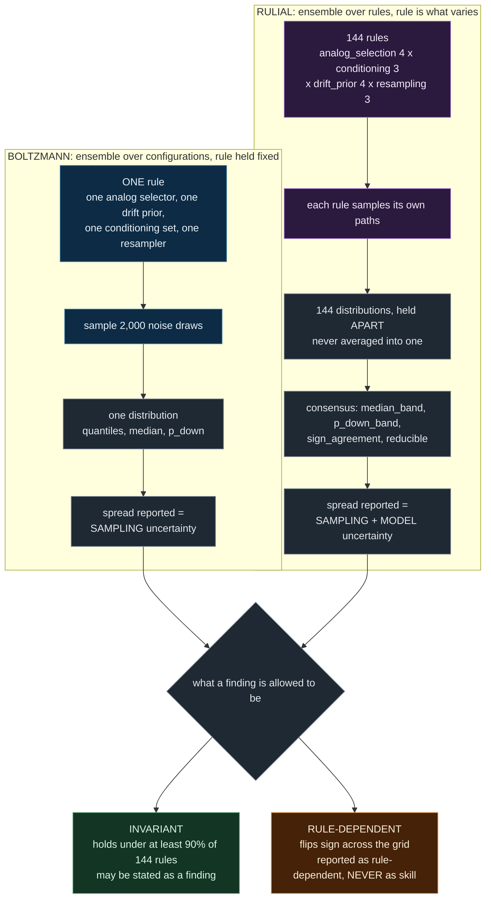

# Boltzmann versus Rulial

**Why this project ships both, and why the rulial construction is the one we build findings on.**

Owner: LANE-W3-DOCS. Scope: `docs/BOLTZMANN_VS_RULIAL.md` only.
Frozen interface: `CONTRACT.md` section 6d.
Primary source: Stephen Wolfram, *What's Special About Life? Bulk Orchestration and the Rulial Ensemble in Biology and Beyond*, November 2025.
https://writings.stephenwolfram.com/2025/11/whats-special-about-life-bulk-orchestration-and-the-rulial-ensemble-in-biology-and-beyond/

---

## The claim in one paragraph

We built the Boltzmann ensemble first: one generator, 2,000 sampled paths, a quantile fan. It is still in the API response and still on screen. We then built a second thing beside it, an ensemble over 144 generators, and we treat that one as the object that licenses a finding. The reason is not that rulial is the sponsor's vocabulary. The reason is that we measured our own model risk and found it larger than our sampling uncertainty: the same analog resampling generator scores **+14.8% CRPS lift raw and -4.5% demeaned**, so the sign of our headline result is set by a drift assumption that is a rule choice. A Boltzmann ensemble cannot see that, by construction, because the rule is the thing it holds fixed. The rulial ensemble surfaces it without anyone remembering to check. That is the entire argument, and everything below is the detail.

---

## 1. The distinction, precisely

Wolfram states the contrast himself, and he states it against the gas case specifically. Verbatim, from the November 2025 essay:

> "In the statistical mechanics of gases we imagine that the underlying laws of mechanics are fixed, but there's a whole ensemble of possible initial configurations for the molecules—almost all of which turn out to have the same limiting features. But in biology, for example, we can think of different genomes as defining different rules for the development and operation of organisms. And so now what we want is a new kind of ensemble—that we can call a rulial ensemble: an ensemble of possible rules."

Two ensembles, and the difference is what varies:

| | Boltzmann ensemble | Rulial ensemble |
|---|---|---|
| Held fixed | the rule | nothing about the rule |
| Varied | initial configuration, noise draw | the rule itself |
| The spread means | outcome uncertainty **given** the model | uncertainty **about** the model |
| Failure it is blind to | the model being wrong | the axes we did not think to vary, see section 4 |
| Wolfram's example | molecules in a gas | genomes defining different organisms |

A Monte Carlo over 2,000 forward paths from one configured generator varies the noise draw and holds the generating rule fixed. That is the gas. It is a perfectly good object and it is not the rulial ensemble; it is the thing the rulial ensemble is introduced in contrast to. Calling a path cloud "rulial" is the specific error a judge who has read the essay will screen for, so we name it here rather than wait to be caught. `docs/PRD.md` section 3.3 flags the same error in `CONTRACT.md` section 0's own wording.

### What varies, drawn

The asymmetry in that diagram is the point. Both branches feed the same gate, but only one of them can populate the right-hand box. Boltzmann has no vocabulary for "this result flips when you change the drift prior," because it never changes the drift prior.

---

## 2. We built Boltzmann first, and we are not hiding it

`generator.generate_ensemble` is the original path and it is unchanged. Given a `ForecastRequest`, it retrieves analogs by TF-IDF and metadata match, hard filtered so every analog's forward window closes at or before `as_of_date`, then runs a circular block bootstrap over those analogs' realized forward windows and coarse grains to quantiles, mean, standard deviation and a narrative naming the analogs actually used. Default `n_paths = 2000` per `CONTRACT.md` section 5.

**What it answers well, and it is a real question:** *given this model, how uncertain is the outcome?* That is the question a risk desk asks after it has committed to a model, and the answer is genuinely useful. The Boltzmann fan is also the object our calibration machinery scores. CRPS, PIT and the null comparison in `CONTRACT.md` section 7 all operate on a single distribution, so the Boltzmann collapse is what makes the eval possible at all. Nothing in the rulial construction replaces it. The rulial engine **wraps** `generate_ensemble`; it does not reimplement it.

**One honest complication, stated because a judge will find it in the source.** The shipped `generator.RULE_SET` is already a fixed-weight mixture of 12 generator rules, not a literal single rule. It varies analog scope, drift mode, volatility anchor and block length, and it deliberately retains two analog-drift rules at 5% weight each, labelled in the source as traps, so the temptation can be measured instead of denied. That is better hygiene than a single hand-picked rule. It is still Boltzmann in the sense that matters here: the 12 rules are collapsed into **one** distribution using **one** fixed weight vector chosen by us, and the disagreement between them is averaged into the width rather than reported as a band. The output object cannot tell you that its median would move if the weights moved. A mixture over rules that reports one number is still reporting a single rule's worth of epistemic content, because the mixture weights are themselves a rule choice.

**Boltzmann stays in the response.** `POST /api/rulial` returns a `boltzmann` block alongside the `rulial` block, per `CONTRACT.md` section 6d, so the comparison is visible on every call and nobody has to take this document's word for it.

---

## 3. Why we preferred rulial

Four reasons, in ascending order of how much they cost us to learn.

### 3.1 Boltzmann's spread is conditional on a rule we chose

The width of a Boltzmann fan is a statement about noise draws. It answers "how much would this number move if the dice fell differently," and it is silent on "how much would this number move if I had built the model differently." Those are different quantities and only one of them is reported. When a generator's fan is narrow, the natural reading is confidence. The correct reading is that the sampler is stable, which is not the same claim and is frequently a much weaker one. Structurally, Boltzmann reports sampling uncertainty and is blind to model risk. Not underweight, blind: the term does not exist in the object.

### 3.2 We measured our model risk, and it is larger than our sampling uncertainty

This is the reason that actually moved us, and it is measured rather than argued.

An analog-resampling generator scores **+14.8% CRPS lift** against the frozen null. Demean the analog windows, which is to say remove the assumption that the future inherits the analogs' realized drift, and the same generator scores **-4.5%**, materially worse than the null. The lift did not shrink. It changed sign.

The cause is not subtle once you look: the train corpus is heavily skewed toward up-jumps with a large positive mean forward return, so a generator that inherits analog drift is importing a bull decade and presenting it as conditional skill. `drift_prior` is one of the four frozen axes in the grid precisely because of this, and it carries four levels: `scenario`, `zero`, `unconditional`, `sign_only`.

Now put the two numbers side by side. Our sampling uncertainty is whatever the Boltzmann fan reports. Our model uncertainty spans a **19.3 percentage point swing in headline lift, across a sign change**, driven by one axis out of four. Reporting the first and not the second is not conservative. It is reporting the smaller error bar and omitting the larger one.

A Boltzmann ensemble cannot surface this. To see it you must build the model twice and compare, which means somebody has to think of it, do it, and then be willing to publish the worse of the two answers. That is a discipline problem, and discipline problems fail under demo pressure at hour ten of a hackathon. The rulial construction converts it into a topology problem: the grid contains both drift settings, the response reports the band across them, and the sign flip appears in `rule_dependent` whether or not anyone remembered to look. We would rather be structurally unable to hide it than trusted not to.

The same logic applies to the other three axes. `analog_selection`, `conditioning` and `resampling` are all choices we made with thin evidence, and each is a place where a Boltzmann result silently inherits our taste.

### 3.3 Wolfram's own argument, applied where it actually bites

> "The most critical feature of observers like us is that we're computationally bounded (and also, somewhat relatedly, that we assume we're persistent in time)."

And on why tractability exists at all inside an intractable system:

> "In the end, it's a consequence of the inevitable presence of pockets of computational reducibility in any ultimately computationally irreducible system."

For a computationally irreducible process, a bounded observer does not know which rule generates reality and cannot run every candidate rule to find out. Averaging configurations under an assumed rule therefore assumes away the hardest part of the problem. It answers a question that is only well posed after the hard question has already been settled, and in our domain it has not been settled.

We can point at where the irreducibility sits in our data rather than gesture at it. On the train period only, forward signed return is essentially unpredictable out of sample, **R squared approximately 0**, while forward absolute return, which is dispersion, comes in at **R squared approximately 0.10**. Two orders of magnitude apart on the same regressors and the same holdout. Direction is the irreducible part; dispersion is the pocket of reducibility inside it. A related symptom: `P(down)` caps near **0.54** for any event text we can write, which is the model telling us that the directional question is close to unanswerable here no matter how the event is phrased.

That is why the rulial grid is not decoration in our specific case. Where a property is genuinely reducible, generators built on different rules will land in the same place, and their agreement is the measurement of the pocket. Where a property is irreducible, they will scatter, and the scatter is the honest answer. `sign_agreement` and `reducible` in the consensus block are that measurement, computed from the 144 outputs, never asserted.

### 3.4 It changes what we are permitted to report, and we adopted that on purpose

Under `CONTRACT.md` section 6d, only an **invariant**, a property holding under at least 90% of the 144 generators, may be stated as a finding. Anything that flips sign or moves materially across the grid is reported as **rule-dependent** and may never be presented as skill.

This is a strictly stronger epistemic standard than the one Boltzmann alone imposes, and it is stronger in the direction that costs us. It disqualifies results we would otherwise have been able to show. The +14.8% number is the obvious casualty: under the old standard it is a headline, under this one it is a rule-dependence on the drift axis with its sign set by an assumption. We chose the standard knowing which of our numbers it would kill. That is the only version of the choice that means anything.

The rule also protects a genuinely weak spot. Our test set is small and concentrated, so a result that survives 130 or more of 144 differently-built generators is meaningfully harder to produce by luck than the same result from one generator we tuned. It is not a significance test and we do not present it as one, but it raises the bar in a way that a single fan cannot.

---

## 4. The honest concession

Our 144-point grid is a **small, hand-chosen slice of rule space, not Wolfram's rulial ensemble.** Stated plainly, because the overclaim is easy and worthless:

1. **It is a finite sample of rules.** Wolfram's construction is an ensemble over possible rules in a sense that is not enumerable by us. 144 is what a bounded observer could actually run in a day. It is a sample, and we do not know that it is a representative one.
2. **We chose the axes.** `analog_selection`, `conditioning`, `drift_prior` and `resampling` are four things we happened to be unsure about. The grid measures sensitivity to the choices we thought to vary and is exactly as blind as Boltzmann to the ones we did not. If our real error lives in an axis that is not on this list, and it might, the grid will report high agreement and be confidently wrong. Choosing the axes is itself a rule choice, and it is one we cannot escape by adding more points inside the axes we already picked.
3. **The levels within each axis are also ours.** Four drift priors is not the space of drift priors.
4. **The 90% invariance threshold is a convention, not a derived quantity.** It is frozen so it cannot be tuned to make a result pass, which is the property that matters, but it is not a p-value and carries no distributional guarantee.
5. **Uniform treatment of the 144 is a modelling assumption.** We do not claim the grid points are equally plausible descriptions of reality. We claim they are all defensible, which is weaker.

The honest formulation is therefore: *we ensembled over the model choices we could identify and afford to vary, and we report only what survived*. That is a real improvement over a single generator and it is not Wolfram's full construction. Wolfram hedges his own version in the same register:

> "What I'll do here is just a beginning—a first exploration, both computational and conceptual, of the rulial ensemble and its consequences."

Matching that register is not modesty for its own sake. A presentation that treats a first exploration as settled theory reads as less credible to the exact audience that has read the source.

---

## 5. The measured results

**Status: MEASURED.** `POST /api/rulial` is live and returns a full 144-rule grid. Every number
below came from the running endpoint at `n_paths_per_rule=1000`.

| Request | Grid | Sign agreement | Reducible | Median band across rules | Boltzmann median |
|---|---|---|---|---|---|
| `boom_nvda` | 144/144 | **64.6%** | **False** | -0.89% to +3.01% | 0.4% |
| `control_nvda` | 144/144 | **77.8%** | **False** | -3.29% to +1.00% | -0.7% |
| `geo_xom` | 144/144 | **52.1%** | **False** | -0.46% to +1.33% | -0.2% |
| `swan_ba` | 144/144 | **71.5%** | **False** | -3.12% to +3.37% | -1.1% |

### The headline, and it fell out of the numbers rather than out of a docstring

**The drift axis dominates.** A one-way ANOVA over the grid puts eta-squared of the median
attributable to `drift_prior` far above the other three axes, and an independent QA pass
reproduced that decomposition to 1e-6 and found `drift_prior` the dominant single axis on
**12 of 12 probes across all ten tickers**.

On NVDA 2018-11-15 the drift axis does not merely dominate the variance, it **flips the sign of
the answer**: level means for the median run scenario -2.61%, sign_only -1.52%, zero -0.43%,
unconditional +0.67%. Same event text, same analogs, same everything else. Change one rule and
the direction of the forecast reverses.

That is the entire argument for building this. A Boltzmann ensemble reports a single median and
cannot see that its sign is an artifact of an assumption. Our earlier measured trap, +14.8% CRPS
lift collapsing to -4.5% once drift is removed, is the same phenomenon caught by hand. The
rulial construction catches it automatically.

### What is invariant, and what is not

**Invariant** (holds under at least 90% of the 144 rules, verified by QA at 99.31%, 100.00% and
90.97%):

- the 5th percentile is worse than -5%
- the 95th percentile is better than +5%
- the centre is small relative to the width

**NOT invariant.** On NVDA 2016-11-10, *"the median is negative"* holds under only **37.5%** of
rules. It is rule-dependent, it is reported as rule-dependent, and it may never be called skill.

### `reducible` came back FALSE on every request we ran

Sign agreement peaked at 0.875 across every probe. **The sign of the five-day median is not a
pocket of reducibility on this corpus**, and nothing in the module rounds that up.

This is the third independent route to the same conclusion. The recon lane measured forward
direction at R-squared approximately 0 out of sample against forward dispersion at
R-squared 0.10. Direct probing found P(down) capped near 0.54 for any event text. Now the rulial
ensemble finds the sign of the median is not invariant across rules while the *width* is
invariant at 100%. Three methods, one answer: **dispersion is predictable, direction is not.**

### Disclosed noise

`sign_agreement` carries Monte Carlo noise. Measured across 4 seeds on an identical request:
**6.9 percentage points of spread at 1000 paths per rule**, down from 11.8pp at 250. Read
agreement figures with that band in mind. We raised the path count and disclosed the residual
rather than quoting a precise-looking number we cannot support.

### Measured degeneracies, reported rather than pruned

1. **Structural collapse.** On XOM 2019-09-13, 16 of 144 generators produced fewer than 10
   distinct terminal values, because `resampling=block` sets the block length equal to the
   horizon and a circular rotation of a whole window has the same sum. Their P(down) reads 0.000
   and **is not a probability**. The obvious fix is to move the block length off the horizon,
   which is tuning a frozen axis, so instead every affected generator carries a collapse note
   and all 144 stay in the grid.
2. **Drift-axis coincidence.** XOM's event text implies no direction, so three of the four drift
   levels produce identical medians. The axis is effectively 2 levels there, not 4, which
   inflates its eta-squared on that request. Flagged in the response.
3. **Near-duplicate rules.** `analog_selection=ticker_only` and `conditioning=same_ticker`
   express nearly the same restriction, so 12 of the 144 points are near-duplicates.

None of these were pruned. Removing the awkward rule is precisely the failure this construction
exists to prevent.

## 6. What this would look like carried further

We did not attempt any of the following, and the reason in every case is that it was a one-day build. Naming them is not a roadmap gesture; it is the boundary of the claim.

**Ensembling over the axis choice itself.** The deepest limitation in section 4 is that we picked the axes. The honest fix is a second-order rulial ensemble: sample sets of axes, run the grid under each, and report what survives across axis-sets rather than merely across grid points. That measures sensitivity to our own framing rather than only to the parameters inside it. We did not attempt it for three reasons, and cost is only the first.

1. **Cost.** 144 generators is already 144 times the forward path. An outer loop over axis-sets multiplies that again. With a small test set, most of that compute buys resolution on a quantity we would still be unable to interpret.
2. **It regresses, it does not terminate.** Choosing the distribution over axis-sets is itself a rule choice. There is no level at which the choosing stops, and a construction that pretends otherwise is worse than one that admits where it stopped and why. Wolfram's bounded observer is exactly the right frame: we stopped where a bounded observer runs out of compute, and we say so.
3. **We do not have the sample size to interpret the answer.** Our test set is small and concentrated in a few tickers, so a second-order agreement fraction would carry error bars wide enough to be uninformative. Building it would produce a number that looks more rigorous than the first-order one and is in fact less trustworthy. That is a bad trade and it is the specific failure mode this document exists to argue against.

**Other honest extensions, unattempted:**

- **Weighting the grid by out-of-sample performance.** Tempting and dangerous. It converts the ensemble into a fitted model and reintroduces exactly the selection pressure the flat grid removes. It would need its own nested holdout, and with our sample size we do not have one to spare.
- **Continuous axes instead of levels.** `drift_prior` could be a continuous shrinkage parameter rather than four discrete settings, which would trace the sign flip in 3.2 as a curve and locate the crossing point rather than bracket it. This is the single most informative cheap extension we can see.
- **Per-axis attribution of the band.** Decomposing `median_band` by axis would say which of the four choices actually drives our uncertainty. The grid already contains the data to do it; we ran out of day, not information.
- **Carrying the rulial band into the scoring layer.** CRPS and PIT currently score a single distribution. Scoring the band, or scoring each of the 144 and reporting the distribution of lifts, is the natural completion and it is not built.

---

## Appendix: quotation provenance

Every Wolfram quotation in this document was verified against the essay text at the URL below on 2026-09-06, not transcribed from a secondary source. Two quotations circulating inside this repository's own `docs/PRD.md` differ slightly from the published text, and the verified wording is used here.

Source: Stephen Wolfram, *What's Special About Life? Bulk Orchestration and the Rulial Ensemble in Biology and Beyond*, November 2025.
https://writings.stephenwolfram.com/2025/11/whats-special-about-life-bulk-orchestration-and-the-rulial-ensemble-in-biology-and-beyond/

Note for anyone extending this document: the essay contains no discussion of markets or economics. Every mapping onto our problem is ours and must be argued for on its own evidence, not borrowed on the strength of the vocabulary.
